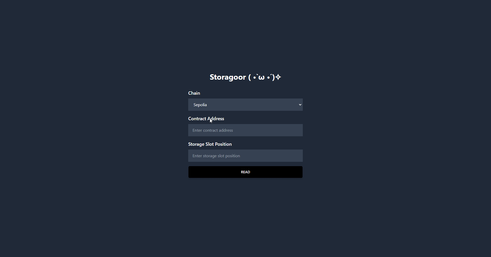

# Storagoor ( •̀ ω •́ )✧



Click the image below to be redirected to a VERY COOL YOUTUBE VIDEO ABOUT STORAGOOOOOOR
[](https://www.youtube.com/watch?v=gj-wvpb_e6Q)


Storagoor ( •̀ ω •́ )✧ is a web3 app that allows users to read storage slots of Ethereum contracts.   It is derived from the Scaffold-Eth 2 template and uses Next.js, TypeScript, and Hardhat.

## Features

- Read Ethereum contract storage slots by providing the contract address and slot number
- Automatically decode storage slot data into human-readable formats
- Chain selection to switch between Ethereum networks
- Responsive and user-friendly interface

## Requirements

Before you begin, you need to install the following tools:

- Node (v18 LTS)
- Yarn (v1 or v2+)
- Git

## Quickstart

To get started with Storagoor ( •̀ ω •́ )✧, follow the steps below:

1. Clone this repo & install dependencies:

```
git clone https://github.com/portdeveloper/storagoor
cd storagoor
yarn install
```

2. start your Next.js app:

```
yarn start
```

Visit your app on: http://localhost:3000. 

## Contributing

Contributions to the Storagoor ( •̀ ω •́ )✧ are welcomed! If you have any suggestions or improvements, feel free to create a pull request or open an issue.

## License

This project is open-source and available under the [MIT License](LICENSE).

## Acknowledgements

This project is derived from the [Scaffold-Eth 2](https://github.com/scaffold-eth/se-2.git) template.
Massive thanks to Austin Griffith, Carlos Sánchez, and all the others who helped me build this!
